  

  

  <strong>AI Product Manager</strong> · Agent · Workflow · Connector · Web Coding

  

## Hi, I'm Elia 👋

I collect fuzzy ideas, ask them far too many questions, and turn the survivors into tiny working products.

我喜欢收集那些还说不清楚的点子，追着它们问很多问题，再把幸存下来的那个做成真正能跑的产品。

I'm an **AI Product Manager** currently exploring how **Agents, Workflows, and Connectors** can turn isolated model capabilities into complete product experiences.

我是一名 **AI 产品经理**，正在接触和学习智能体相关的产品形态，包括 **Agent、Workflow 和 Connector**，也在研究怎样把模型能力连接成真正完整、好用的产品体验。

### A few things about me / 关于我的几个关键词

- 🧠 **Product brain:** turn user needs into clear hypotheses and testable flows
- 🛠️ **Prototype hands:** build lightweight web experiences instead of leaving ideas in slides
- 🧩 **Agent curiosity:** explore Agent behavior, Workflow orchestration, Connectors, tools, and reusable Skills
- 🌏 **Bilingual mode:** switch between Chinese and English without rebooting

If a concept feels confusing, my first reaction is usually:

> Can we turn it into a flow, a prototype, or a Skill?

## Building now / 正在开发

### Learn New Things

> My current side quest: teaching a Skill how to help people learn.

它是一个面向新事物、新概念、实践技能和大学期末复习的自主学习 Skill——不只给你一堆资料，而是陪你真正学会。

| Mode | Goal |
| --- | --- |
| `concept` | Understand an unfamiliar idea and build a clear mental model |
| `skill` | Learn by producing exercises and a practical artifact |
| `exam` | Prioritize high-impact topics before a fixed deadline |

The learning loop:

`diagnose → prioritize → learn → retrieve → apply → review → adapt`

Current focus:

- diagnose the learner's baseline before creating a plan;
- generate small, practical daily learning sessions;
- use retrieval, application, and error logs as evidence of mastery;
- adapt the next session from real learning results;
- keep the experience portable and privacy-conscious.

The project is still growing in public. Today it is a Skill; tomorrow it may become a fuller learning product.

这个项目正在公开生长中：今天它是一个 Skill，明天也许会长成一个更完整的学习产品。

## Product interests / 关注方向

`AI Product` · `Agent` · `Workflow` · `Connector` · `Web Experiences` · `Learning Tools`

## Let's connect / 联系我

- Email: [liaxuan_1206@qq.com](mailto:liaxuan_1206@qq.com)

---

  Serious about useful products. Not always serious about the process.

